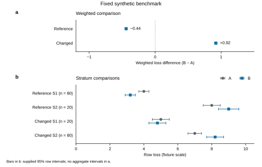

# A reference-average gain does not establish robustness: a synthetic A–B benchmark

*Fixed synthetic development sample; not an empirical research article.*

## Abstract

A favorable benchmark average can support a narrower claim than the decision to replace an existing method. This fixed synthetic comparison examines whether method B's reference-average advantage over method A persists across acquisition conditions and strata. Eight manufactured summaries cover two methods, two conditions and two strata. Sample-weighted loss is lower for B in the reference condition: 4.36 versus 4.80 for A, a B-minus-A difference of −0.44. In the changed condition, B's weighted loss is higher: 7.52 versus 6.60, a difference of +0.92. B also has higher loss in S2 in both conditions, despite having lower loss in S1. The reference mixture assigns 80% of the weight to S1; the changed mixture assigns 80% to S2. The established result is therefore a conditional average benefit with an explicit counterexample to a general improvement claim. Reporting the average together with strata and evaluation conditions preserves that benefit while defining its scope. These manufactured summaries support descriptive comparisons; they do not identify a causal acquisition mechanism or provide aggregate uncertainty.

## Introduction

Replacing an estimation method requires evidence about where its advantage holds. A lower average loss in a reference benchmark is useful, but the average alone does not establish improvement within every stratum or under a different acquisition setting. When stratum composition changes, the decision must account for both the performance within each stratum and the weights used to summarize it.

The supplied fixture makes this distinction explicit. It compares methods A and B under reference and changed acquisition conditions, using lower loss as the favorable outcome [E1]. The stratum mixture differs between conditions [E2]. The question is whether B's favorable reference average supports an improvement claim across the comparisons provided, rather than whether B is universally superior or why its performance differs.

The contribution of this development sample is a concrete reporting lesson: an average gain must remain attached to its evaluation condition and stratum composition. The evidence establishes B's reference-average benefit, locates the S2 counterexample within that same condition, and shows a reversal in the changed-condition average. Presenting these results together answers the decision question more clearly than either a favorable average alone or a general statement that the evidence is limited.

## Methods

### Fixed material and comparison

The material comprises eight manufactured benchmark summaries: one for each combination of two methods, two conditions and two strata [E1]. These are fixed development fixtures, not collected observations. A and B have identical supplied counts within each condition–stratum combination. In the reference condition, S1 has n = 80 and S2 has n = 20; in the changed condition, S1 has n = 20 and S2 has n = 80. The count total is 100 for each method within each condition. Here, n supplies the weighting rule; it is not evidence of recruited participants or independent empirical replicates.

Loss is reported on the supplied fixture scale, with lower values indicating better performance. For method m in condition c, sample-weighted loss is:

`L(c,m) = [n(c,S1) × loss(c,S1,m) + n(c,S2) × loss(c,S2,m)] / [n(c,S1) + n(c,S2)]`.

All differences are defined as B minus A. A negative difference favors B; a positive difference favors A. We report both condition-specific weighted losses and the stratum comparisons that those averages summarize. No new metric, fitted model or experiment was introduced.

### Uncertainty and interpretation

The supplied intervals are 95% intervals for the individual row summaries. Their construction and dependence structure are not provided. They are reproduced unchanged in Table 1 and Figure 1b; they are not intervals for weighted averages or B-minus-A differences. We did not re-estimate them, combine their endpoints into aggregate intervals, calculate p values or infer significance from interval overlap or separation.

Acquisition condition is an evaluation setting, not an assigned intervention. Because both the setting and stratum mixture differ between conditions, their aggregate comparison does not identify a causal acquisition effect. The analysis is descriptive arithmetic on the frozen summaries. No data collection, recruitment, model fitting, new sample simulation or additional experiment was performed.

Figure 1 separates the condition-level decision contrast from the stratum-level evidence needed to interpret it [E3]. Panel a shows weighted differences without uncertainty bars; panel b shows every supplied row loss and its interval, making the S2 counterexample visible.

## Results

### The reference-average benefit coexists with a stratum counterexample

In the reference condition, weighted loss is 4.80 for A and 4.36 for B, yielding a B-minus-A difference of −0.44 (Table 2; Figure 1a). This favorable average summarizes opposite directions across the two strata. In S1, loss decreases from 4.0 for A to 3.2 for B, a difference of −0.80. In S2, it increases from 8.0 to 9.0, a difference of +1.00 (Table 1; Figure 1b).

The supplied reference-S2 intervals are [7.5, 8.5] for A and [8.4, 9.6] for B. They locate the row summaries and their supplied uncertainty; they do not establish the statistical significance of the method difference. S1 carries 80% of the reference weight, so the weighted benefit is compatible with higher B loss in S2.

### The changed-condition average favors A

In the changed condition, weighted loss is 6.60 for A and 7.52 for B, giving a difference of +0.92 (Table 2; Figure 1a). B retains a lower loss in S1, at 4.8 versus 5.0 for A, but has a higher loss in S2, at 8.2 versus 7.0. The respective stratum differences are −0.20 and +1.20.

The changed-S1 intervals are [4.5, 5.5] for A and [4.3, 5.3] for B; the changed-S2 intervals are [6.6, 7.4] and [7.7, 8.7], respectively. S2 carries 80% of the changed-condition weight. Thus B's weighted advantage does not persist across both supplied conditions, and its within-stratum advantage does not extend to S2 in either condition. These are comparisons within the fixture, not a test of an acquisition mechanism.

### Tables and figure

**Table 1 | Complete fixed row summaries**

| Condition | Stratum | Method | n | Loss | Supplied 95% interval |
|---|---|---|---:|---:|---|
| Reference | S1 | A | 80 | 4.0 | [3.7, 4.3] |
| Reference | S1 | B | 80 | 3.2 | [2.9, 3.5] |
| Reference | S2 | A | 20 | 8.0 | [7.5, 8.5] |
| Reference | S2 | B | 20 | 9.0 | [8.4, 9.6] |
| Changed | S1 | A | 20 | 5.0 | [4.5, 5.5] |
| Changed | S1 | B | 20 | 4.8 | [4.3, 5.3] |
| Changed | S2 | A | 80 | 7.0 | [6.6, 7.4] |
| Changed | S2 | B | 80 | 8.2 | [7.7, 8.7] |

All eight rows and interval endpoints are reproduced from the frozen table [E1]. Counts define the weights used in Table 2. No row was excluded. Loss units beyond the fixture scale are unspecified, and the intervals do not represent uncertainty in the aggregates.

**Table 2 | Condition-specific sample-weighted comparisons**

| Condition | S1:S2 weights | Weighted loss A | Weighted loss B | B minus A |
|---|---|---:|---:|---:|
| Reference | 80:20 | 4.80 | 4.36 | −0.44 |
| Changed | 20:80 | 6.60 | 7.52 | +0.92 |

Each method has total weight 100 per condition. Values were calculated using the Methods formula. A negative difference favors B; a positive difference favors A. No aggregate interval or significance test is available from these summaries.

**Figure 1 | Weighted comparisons and their stratum context.** **a**, Sample-weighted B-minus-A loss for each condition, calculated with the supplied counts. The vertical zero line denotes equal weighted loss; negative values favor B and positive values favor A. No aggregate or difference interval is shown because none was supplied or estimated. **b**, All eight fixed row losses and their supplied 95% intervals. Gray circles denote A and blue squares denote B; horizontal bars reproduce the supplied endpoints. Counts beside each condition–stratum label apply to both methods. The reference S1:S2 mixture is 80:20 and the changed mixture is 20:80. n is a fixture weighting count, not an empirical replicate count. Lower loss is better. Source data are supplied in `fixed-results.csv`; no observations, interval estimates or significance tests were generated.

## Discussion

The reference-average gain establishes a conditional benefit, not improvement across all supplied comparisons. B has lower loss in S1 under both conditions, higher loss in S2 under both conditions, and a weighted benefit in the reference condition that reverses in the changed condition. The S2 result is central to the argument: it prevents the reference average from being read as a benefit shared across strata. The changed-condition average separately prevents the benefit from being read as robust across these evaluation settings.

This supports a specific reporting and evaluation decision. Retain the favorable reference average, but report its mixture and the stratum comparisons alongside it. A decision to replace A across a broader range of conditions would require evidence beyond that average. In this fixture, making the counterexample visible improves the accuracy of the claim without obscuring the reference benefit or treating a local comparison as a universal verdict on B.

The aggregate reversal occurs between conditions with different mixture weights and different row losses. The supplied summaries do not identify how much of that contrast reflects acquisition conditions, mixture changes, method sensitivity or other explanations. Describing these features together is warranted; assigning a causal mechanism to them is not. A prospective validation should compare acquisition settings at a fixed stratum mixture and, separately, vary the mixture while holding the acquisition process fixed [E4]. Such a design would make the competing explanations distinguishable. It remains a proposal, not a completed validation or a guarantee of identification without further design assumptions.

The inferential boundary follows from the material: the summaries are manufactured, the interval dependence is unknown, and only two conditions and two strata are represented. Consequently, the example establishes a descriptive reporting lesson rather than a population performance claim, an aggregate significance claim or a causal mechanism. Its value is the clear separation between a supported average benefit and the broader robustness claim that benefit cannot establish.

## Conclusion

Method B lowers sample-weighted loss by 0.44 in the reference condition and increases it by 0.92 in the changed condition. Its higher loss in S2 in both conditions is the decisive within-stratum counterexample. The supported claim is a conditional average benefit in this fixed synthetic fixture. A broader robustness claim requires additional validation that separates acquisition changes from mixture changes.

## Declarations and references

This manuscript is a fixed synthetic development sample. No empirical data, participants, recruitment, ethics approvals or publication claims are involved. No empirical approvals, registrations, author identities, funding statements or competing-interest declarations have been inferred. The supplied counts, losses and intervals are preserved in the accompanying frozen results table. AI assistance was used to revise the full manuscript, organize its argument, generate a figure from the supplied summaries and perform local arithmetic and consistency checks; independent human scientific review was not performed in this execution. The sample is not presented as a submission-ready article.

E1–E4 are internal synthetic memo labels retained from the supplied manuscript, not published references. The full separate memo documents were not supplied. E1's numeric support is the frozen benchmark table; E2–E4 are supported here only by the descriptions in the supplied manuscript:

- **E1.** Fixed benchmark table and interval definitions.
- **E2.** Context and stratum-mixture memo.
- **E3.** Main-figure evidence brief.
- **E4.** Prospective validation design memo.

**Writing and figure workflow attribution.** The revision used K-Dense's scientific-writing workflow, version 2.1, adapted to a synthetic fixture; the English anti-defensive-writing source for final expression; and Nature Figure, version 2.8.0, for evidence-focused display design and figure checks. These are production resources, not scientific support for the benchmark claims. Repository commits and the exact adopted scope are recorded in the operation note. The scientific-writing resource is described by Kassis, T., Agarwal, V., He, Y., Patel, D., and Brueckner, A. M. (2026), *Scientific Agent Skills: A Library of Procedural Knowledge for Research Agents*, arXiv:2609.00065, current record v2 checked during this execution. [DOI: 10.48550/arXiv.2609.00065](https://doi.org/10.48550/arXiv.2609.00065).
