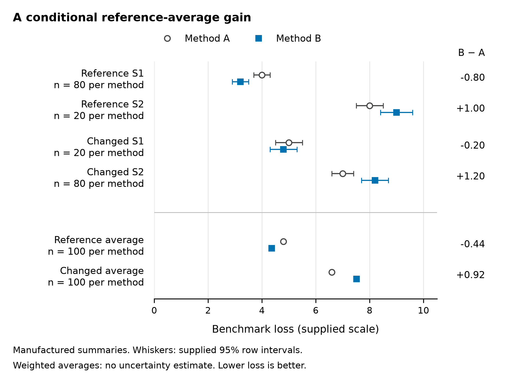

# A reference-average gain is conditional: a fixed synthetic comparison of estimators A and B

Fixed development sample — manufactured summaries; not an empirical article.

## Abstract

A favorable benchmark average does not establish that a method's benefit persists across strata and evaluation conditions. This fixed synthetic comparison makes that distinction explicit using eight manufactured summary rows for methods A and B, two conditions and two strata. Lower loss is better; comparisons use within-stratum losses and sample-weighted averages. B reduces reference weighted loss from 4.80 to 4.36 (B minus A: −0.44), despite increasing S2 loss from 8.0 to 9.0. Under the changed condition, weighted loss instead rises from 6.60 to 7.52 (+0.92). B has lower S1 loss and higher S2 loss in both settings. The central result is a conditional average advantage, with the favorable comparison and its counterexamples visible together. Both the stratum mixture and cell losses differ between settings, so these descriptive summaries do not isolate a causal acquisition mechanism. Supplied intervals describe individual rows; raw observations and dependence information are unavailable for a new aggregate uncertainty estimate or significance calculation.

## Introduction

A claim that an estimator improves average loss must identify the mixture and conditions over which that improvement holds. The relevant reporting question is whether a favorable comparison extends to the constituent strata and to a changed evaluation setting. Collapsing these questions into a single claim that a method is “better” conceals the scope of the evidence.

The supplied benchmark defines lower loss as better and assigns intervals to individual summary rows [E1]. Its context identifies a changing stratum mixture [E2]. The specific question in this fixed development sample is whether B's reference-average gain is shared by both strata and retained under the changed condition. Eight manufactured summaries provide all the evidence for this comparison.

The contribution is a transparent distinction between average improvement and robustness across the declared comparisons. The reference average favors B, yet reference S2 does not; the changed-condition average favors A. Presenting these findings together makes the favorable result precise and its boundary testable. The argument rests on the fixed comparisons, rather than on a new empirical study or an asserted literature gap.

## Methods

### Materials and comparison

The material comprises eight fixed manufactured summary rows: two methods × two conditions × two strata [E1]. All rows are retained. The labels “reference” and “changed” denote acquisition evaluation settings, not randomly assigned interventions. Each method has the same supplied n within a stratum and condition. Reference weights are 80 for S1 and 20 for S2; changed-condition weights are 20 for S1 and 80 for S2. The total is 100 for each method within each condition. These are fixture counts used as weights, not observations collected in this revision.

For condition c and method m, sample-weighted loss is L(c,m) = Σs [n(c,s) × loss(c,s,m)] / Σs n(c,s). Method differences are defined as B minus A within the same condition, and within the same stratum when applicable. A negative difference favors B; a positive difference favors A. Loss is reported on the supplied benchmark scale; no physical unit is specified.

### Uncertainty and display

The loss values and supplied 95% row intervals are unchanged. The interval dependence structure and raw observations are unavailable. No aggregate or difference interval is derived, no significance test is performed, and overlap or separation of row intervals is not treated as a test of a method difference. This revision recomputes the stated weighted averages and simple differences from the frozen values; it does not collect data, fit models, simulate samples or conduct new experiments.

Table 1 retains every summary and its interval. Figure 1 displays the four within-stratum comparisons and the two weighted-average comparisons, allowing the reference S2 counterexample to be located directly [E3]. Row intervals appear only beside their supplied summaries; weighted averages are points without interval estimates. Color and marker shape distinguish methods, and labels report the mixture weights.

## Results

### Reference average advantage and S2 counterexample

In the reference condition, weighted loss is 4.80 for A and 4.36 for B, giving a difference of −0.44. In S1, B lowers loss from 4.0 to 3.2, a difference of −0.80; this stratum carries 80 of the 100 fixture counts for each method. In S2, B increases loss from 8.0 to 9.0, a difference of +1.00, with a weight of 20. The favorable average therefore coexists with a worse B result in S2 (Table 1; Figure 1). The supplied S2 intervals are [7.5, 8.5] for A and [8.4, 9.6] for B.

### Changed-condition weighted comparison reverses

In the changed condition, weighted loss is 6.60 for A and 7.52 for B, giving a difference of +0.92. B lowers S1 loss from 5.0 to 4.8 (−0.20) but increases S2 loss from 7.0 to 8.2 (+1.20). S2 now carries 80 of the 100 fixture counts for each method. The supplied S1 intervals are [4.5, 5.5] for A and [4.3, 5.3] for B; S2 intervals are [6.6, 7.4] and [7.7, 8.7], respectively (Table 1). B's lower loss in S1 is retained in both conditions, whereas its favorable weighted average is not.

**Table 1. All fixed manufactured summary rows.** The supplied n is the same for A and B within each condition–stratum cell. Intervals are the supplied 95% intervals for individual summary rows.

| Condition | Stratum | Method | n | Loss | Supplied 95% row interval |
|---|---|---|---:|---:|---|
| Reference | S1 | A | 80 | 4.0 | [3.7, 4.3] |
| Reference | S1 | B | 80 | 3.2 | [2.9, 3.5] |
| Reference | S2 | A | 20 | 8.0 | [7.5, 8.5] |
| Reference | S2 | B | 20 | 9.0 | [8.4, 9.6] |
| Changed | S1 | A | 20 | 5.0 | [4.5, 5.5] |
| Changed | S1 | B | 20 | 4.8 | [4.3, 5.3] |
| Changed | S2 | A | 80 | 7.0 | [6.6, 7.4] |
| Changed | S2 | B | 80 | 8.2 | [7.7, 8.7] |

**Figure 1. The reference average advantage coexists with an S2 counterexample and reverses in the changed condition.** Circles represent A and squares represent B. The upper four comparisons show every fixed row loss and its supplied 95% row interval; n labels apply to each method separately. The lower two comparisons show sample-weighted losses with total n = 100 per method and condition. They have no interval because aggregate uncertainty is unavailable. Right-hand labels give descriptive B-minus-A differences, with negative values favoring B. No statistical test or significance symbol is used. All values come from the manufactured benchmark table [E1]; no individual observations are plotted.

## Discussion

### A conditional average advantage

The main finding is a conditional average advantage: B improves the reference weighted loss by 0.44, despite a 1.00 increase in reference S2, and its weighted loss is 0.92 higher under the changed condition. The reporting consequence is direct. Retain the reference benefit together with the stratum counterexample and changed-condition reversal; an unqualified statement that B is better would erase evidence essential to its interpretation.

This fixture's contribution is the separation of two reporting claims. A lower weighted loss describes the specified mixture. It does not establish lower loss in every stratum or setting. B's lower S1 loss in both conditions is a supported strength, while its higher S2 loss in both conditions sets a concrete boundary. Neither pattern alone is a universal verdict on B.

Both the mixture and within-stratum losses change between settings. Their joint contrast cannot isolate whether mixture weights, method sensitivity to acquisition conditions, both or another explanation accounts for the aggregate reversal. The figure therefore exposes the comparisons without depicting an untested mechanism.

### Inferential boundary and next validation

The manufactured summaries and unknown interval dependence bound the inference. The supplied row intervals cannot furnish a defensible new uncertainty estimate for a weighted average or method difference by themselves. The two evaluation settings provide no causal contrast or evidence of performance beyond these fixed comparisons.

The next validation should hold the mixture fixed while changing acquisition conditions, and separately vary the mixture with a fixed acquisition process [E4]. Those complementary comparisons would assess the contributions of acquisition and composition changes. They remain prospective studies; they have not been conducted here.

## Conclusion

B's supported advantage is condition-specific: sample-weighted loss is 0.44 lower in the reference condition and 0.92 higher in the changed condition. S2 loss is higher for B in both settings. This fixture establishes a conditional average improvement, not robustness across the declared comparisons. Validation that separates acquisition changes from mixture changes is the next evidential step and remains to be conducted.

## Declarations and references

This is a fixed synthetic development sample, not an empirical article or a publication claim. No empirical data, participants or ethics approvals are involved. Author, affiliation, funding and competing-interest information was not supplied; no submission metadata is asserted.

E1–E4 are internal synthetic evaluation labels retained from the supplied manuscript, not published references. E1 is supported here by the frozen benchmark table and its interval definitions. E2–E4 are described in the supplied text; separate full memos were not supplied.

- E1. Fixed benchmark table and interval definitions.
- E2. Context and stratum-mixture memo.
- E3. Main-figure evidence brief.
- E4. Prospective validation design memo.

### Editorial workflow provenance

The current Codex agent revised the text and checked the supplied summaries without another assistant host or model. Scientific Agent Skills (scientific-writing, version 2.1) informed the evidence-bound full-writing workflow. This attribution concerns editorial assistance, not evidence for the benchmark findings: Kassis, T., Agarwal, V., He, Y., Patel, D., and Brueckner, A. M. (2026). *Scientific Agent Skills: A Library of Procedural Knowledge for Research Agents*. arXiv:2609.00065. https://doi.org/10.48550/arXiv.2609.00065. Metadata was checked against arXiv's current v2 record. SciPilot informed the figure workflow. The designated anti-defensive-writing-en source informed the final argument and expression, with evidence-preserving adaptations recorded in the operation note.
