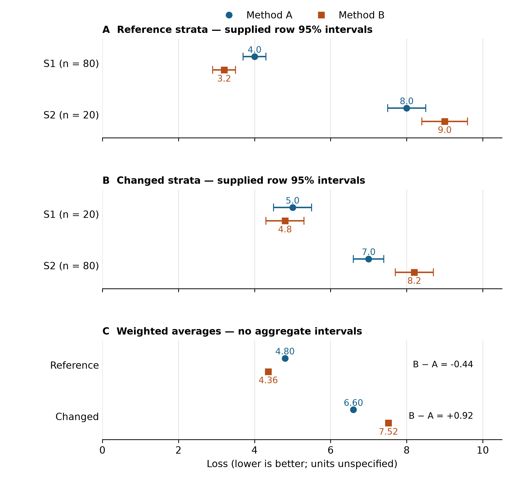

# Conditional average gains in estimation: a fixed synthetic benchmark of methods A and B

*Fixed synthetic development sample — not an empirical article.*

## Abstract

This fixed synthetic benchmark asks what an average loss reduction can support when acquisition conditions and stratum weights differ. Eight manufactured summaries compare methods A and B across two acquisition conditions and two strata. We calculate sample-weighted losses and retain the stratum comparisons. In the reference condition, weighted loss is 4.80 for A and 4.36 for B, a B-minus-A difference of −0.44. That average gain coexists with an S2 disadvantage: loss increases from 8.0 for A to 9.0 for B. In the changed condition, weighted loss is 6.60 for A and 7.52 for B, a difference of +0.92; B again has higher loss in S2. The benchmark therefore distinguishes a supported reference-average gain from an unsupported claim of general robustness. Acquisition conditions and stratum weights change together, so these descriptive summaries do not identify a causal mechanism. The supplied row intervals do not establish uncertainty or significance for the weighted averages.

## Introduction

A decision to replace an estimation method requires a clear account of where its advantage holds. In this fixture, a favorable reference average gives an incomplete answer: performance differs by stratum, and both acquisition conditions and the mixture of strata differ between evaluation settings. The relevant question is whether method B's average gain in the reference setting supports a broader robustness claim.

The benchmark defines lower loss as better [E1]. Its context memo identifies changing stratum mixtures as part of the evaluation problem [E2]. We therefore compare A and B at two levels: the sample-weighted average within each condition and the loss within each stratum. This structure makes an average benefit and its counterexample visible in the same account.

The contribution of this synthetic example is a precise boundary for the claim. B improves the reference average, yet has higher loss in reference S2 and in the changed-condition average. A complete comparison supports a conditional average gain without presenting that gain as general robustness. The objective is to establish this descriptive boundary from the fixed summaries, not to explain an acquisition mechanism or report a new empirical study.

## Methods

### Fixed material and evaluation settings

The supplied material contains eight manufactured summaries: one row for each combination of two methods, two acquisition conditions and two strata [E1]. No data were collected, participants recruited, models fitted, new samples simulated or additional experiments conducted. The n values are the supplied weighting counts, not newly observed participant counts. Within each condition and stratum, A and B have the same n. In the reference condition, S1 has n = 80 and S2 has n = 20; in the changed condition, S1 has n = 20 and S2 has n = 80. Thus each method's weighted average uses a total weight of 100 in each condition.

### Descriptive comparisons

For each method and condition, sample-weighted loss is calculated as:

`Weighted loss = (n_S1 × loss_S1 + n_S2 × loss_S2) / (n_S1 + n_S2).`

Differences are defined as B minus A. A negative difference favors B and a positive difference favors A. We report the weighted comparison in each condition and then inspect the corresponding stratum losses. All comparisons are descriptive; acquisition conditions are evaluation settings, not assigned interventions.

### Intervals and displays

Table 1 preserves every supplied row loss, count and 95% interval. These intervals describe individual summary rows; their construction and dependence structure are not supplied. We do not re-estimate them, infer significance from their overlap, or combine them into an interval for a method difference or weighted average. Figure 1 displays row intervals separately from weighted averages, which have no interval bars. Its purpose is to make the reference S2 counterexample and the reversal of the weighted comparison easy to locate [E3]. Loss units are not specified in the fixture, so no physical units are assigned.

## Results

### A reference-average gain with an S2 counterexample

In the reference condition, weighted loss is (80 × 4.0 + 20 × 8.0) / 100 = 4.80 for A and (80 × 3.2 + 20 × 9.0) / 100 = 4.36 for B. The B-minus-A difference is −0.44. B has lower loss in S1, 3.2 compared with 4.0 for A, but higher loss in S2, 9.0 compared with 8.0. The reference average therefore favors B without implying a benefit in every stratum.

The supplied reference S2 interval is [7.5, 8.5] for A and [8.4, 9.6] for B. The reference S1 intervals are [3.7, 4.3] for A and [2.9, 3.5] for B. Figure 1A shows both stratum comparisons; Table 1 retains their exact values.

### A changed-condition average that favors A

In the changed condition, weighted loss is (20 × 5.0 + 80 × 7.0) / 100 = 6.60 for A and (20 × 4.8 + 80 × 8.2) / 100 = 7.52 for B. The B-minus-A difference is +0.92. B has lower loss in S1, 4.8 compared with 5.0 for A, and higher loss in S2, 8.2 compared with 7.0. The supplied S1 intervals are [4.5, 5.5] for A and [4.3, 5.3] for B; the S2 intervals are [6.6, 7.4] for A and [7.7, 8.7] for B.

Across the two settings, B's lower S1 loss coexists with higher S2 loss. The weighted comparison changes direction: it favors B in the reference condition and A in the changed condition (Figure 1C). B does not improve the weighted average in both settings. This is a comparison of fixed summaries, not a significance result.

### Table 1. Complete fixed benchmark summaries

| Acquisition condition | Stratum | Method | Supplied n | Loss | Supplied row 95% interval |
| --- | --- | --- | ---: | ---: | --- |
| Reference | S1 | A | 80 | 4.0 | [3.7, 4.3] |
| Reference | S1 | B | 80 | 3.2 | [2.9, 3.5] |
| Reference | S2 | A | 20 | 8.0 | [7.5, 8.5] |
| Reference | S2 | B | 20 | 9.0 | [8.4, 9.6] |
| Changed | S1 | A | 20 | 5.0 | [4.5, 5.5] |
| Changed | S1 | B | 20 | 4.8 | [4.3, 5.3] |
| Changed | S2 | A | 80 | 7.0 | [6.6, 7.4] |
| Changed | S2 | B | 80 | 8.2 | [7.7, 8.7] |

*Note.* Lower loss is better. These are manufactured summary rows, not individual observations. Counts are equal between methods within each condition–stratum combination. Intervals are supplied row intervals, not intervals for weighted averages or method differences. Source: supplied fixed-results.csv [E1].

### Figure 1. Stratum comparisons and the reversal of weighted loss

*Caption.* Panels A and B show the reference and changed stratum losses, respectively; labels give the supplied n for each stratum and method. Circles denote A and squares denote B. Horizontal bars reproduce the supplied row 95% intervals. Panel C shows sample-weighted averages, computed separately for each method and condition; it has no interval bars because aggregate uncertainty is unavailable. All panels use the same loss scale; lower loss is better. The data are manufactured fixture summaries. Source: fixed-results.csv [E1]; display purpose: [E3].

## Discussion

The benchmark supports a conditional average gain. B lowers the reference average by 0.44, but its higher S2 loss is already visible within that favorable setting. The changed-condition average then favors A by 0.92. These comparisons answer the central question: the reference average alone does not establish general robustness.

The reporting implication is concrete. Present the reference-average benefit together with the stratum comparison and the second condition. Otherwise, the average conceals an S2 disadvantage that directly affects the scope of the claim. The fixture does not warrant judging B as universally inferior either: its loss is lower in S1 in both conditions. The supported account specifies the condition and level of aggregation at which each comparison holds.

The summaries do not identify why the weighted comparison changes direction. Both acquisition conditions and stratum weights differ between settings, while the row losses also differ. The comparison cannot establish a causal acquisition effect or determine the separate roles of mixture weights, method sensitivity, their combination or another explanation. A prospective validation would hold the mixture fixed while changing acquisition conditions, then separately vary the mixture under a fixed acquisition process [E4]. Those studies have not been conducted in this fixture.

The inferential boundary follows from the material: manufactured summaries support a descriptive demonstration, not empirical generalization; unknown interval construction and dependence prevent a new aggregate uncertainty calculation; and two evaluation settings do not validate behavior in other settings. These boundaries constrain interpretation while leaving the reported average and stratum comparisons intact.

## Conclusion

Method B lowers sample-weighted loss by 0.44 in the reference condition and increases it by 0.92 in the changed condition. Its lower S1 loss and higher S2 loss in both settings define the scope of its advantage. The contribution is an explicit distinction between a reference-average improvement and general robustness. A robustness claim requires additional validation that separates acquisition changes from mixture changes.

## Declarations and references

This is a fixed synthetic development sample. No empirical data, participants, ethics approvals or publication claims are involved. E1–E4 are internal synthetic evaluation memo labels identified in the supplied manuscript, not published references. Separate memo documents were not supplied; the present revision uses the manuscript's descriptions and the fixed results table.

- **E1.** Fixed benchmark table and interval definitions.
- **E2.** Context and stratum-mixture memo.
- **E3.** Main-figure evidence brief.
- **E4.** Prospective validation design memo.
